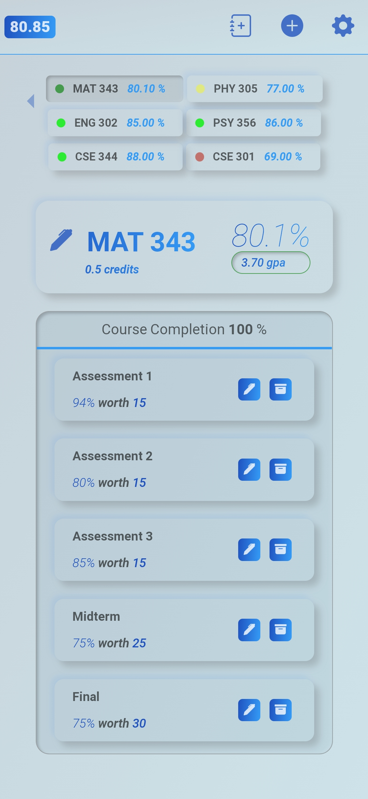

# Qalculater
An app that removes my reliance on sticky notes to keep track of my academic progress. The app can be accessed here:


https://qalculater.netlify.app/login


>**Home Screen**



>## **Why?**
Many tools used by the university do not give us an accurate picture of where we stand academically in the term. Tools such as crowd mark, learn, etc. are used and there is no central point to have an overview of your marks. Thus, after failing to search for an app that can provide me with the following:

    1. Keeps track of my academic progress (not just a calculater which calculates my average)
    
    2. Provides a good and clean user experience

    3. Gives me relevant data such as my GPA

    4. Overall average across all courses and taking into account 
    different credit weightage of courses

    5. The data persists after I logout

I decided to build the Qalculater App. Having used it personally for more then a year, it has allowed me to be much more aware of what courses I need to focus on and has made it extremely more efficient to record my marks.

>## **Technologies used**
The MERN stack was used, due to the following reasons

1. Having familiarity with react I chose to go with this. It allows the developer to re-render specific components without having to refresh the app which allows for a better user experience.

2. Sass was used over css due to its many helpful features mainly variable declaration and mixins

3. Express was used over other methods such as Spring due to its minimalistic nature and it meets my requirements which are
    - To handle http GET/POST requests from the front-end
    - Interact with the MongoDB database to obtain user data
    - Handle user authentication and registration (which was taken care of by using the passportJS middle ware)
    - It uses JavaScript which eases up developement a bit more as I am using the same language in the front-end

>## Community packages used
Another benefit of using a javascript library such as react is having access to a massive library of community provided npm packges that I have used to provide for a better user experience:
- <a href="https://www.npmjs.com/package/react-notifications" target="_top">React Notifications</a> for provding responses from the backend and general updates to the entries
- <a href="https://www.npmjs.com/package/react-responsive-carousel" target="_top">React Responsive Carousel</a> used to switch between the course and term components
- <a href="https://www.npmjs.com/package/react-bootstrap-icons" target="_top">React Bootstrap icons</a>

>## Structure of the user metadata
The marks are stored as a JSON object in the following structure:
```json
{
    "Term name": {
        "Course Name": {
            "credit": 0.5,
            "data": [
                [
                    "assessment name",
                    "your percentage in assessment",
                    "the weight of the assessment"
                ]
            ]
        }
    }
}
```
# Resources Used
Having unfamiliarity with passportJS the following resources were used to help me with user Authentication:

-   <a href="https://youtu.be/F-sFp_AvHc8" >User Authentication in Web Apps (Passport.js, Node, Express)</a> a 6 hr course provided by freeCodeCamp.org which details different authentication methods and how to incorporate passportJS with Express.
-   <a href = "http://www.passportjs.org/" >Pssportjs</a> The official Passport JS documentation site
